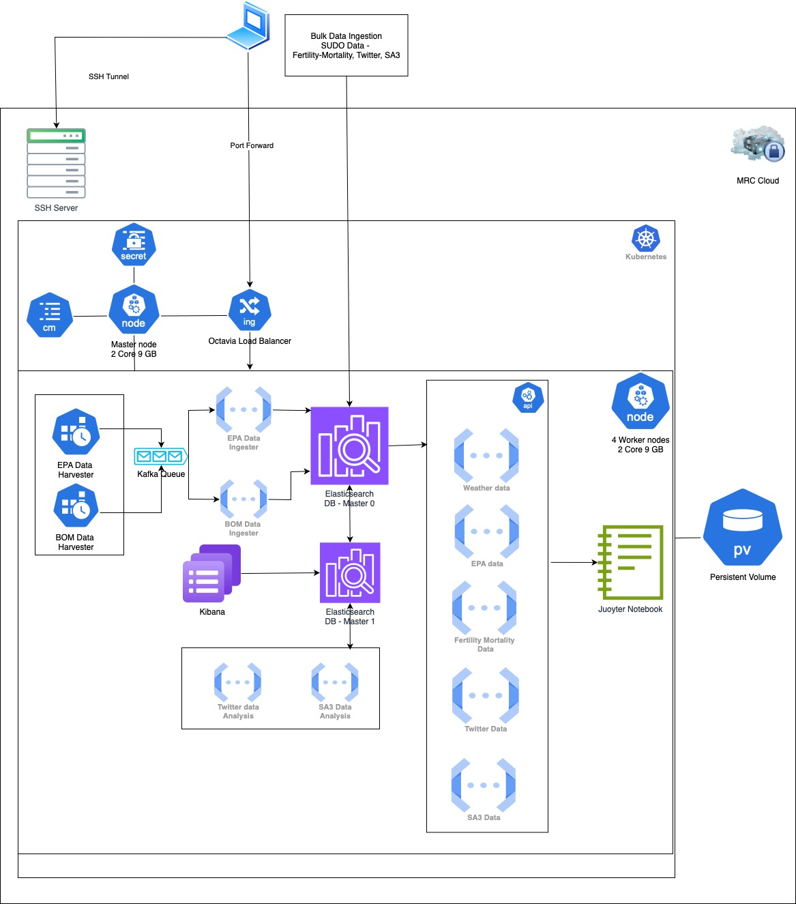

# COMP90024: Cluster and Cloud Computing Assignment 2 - Big Data Analytics on the Cloud 

# System Architecture



# Setup instructions
```https://gitlab.unimelb.edu.au/feit-comp90024/comp90024```

# Troubleshooting
Should you get an error on cluster creation as `openstack: 'coe' is not an openstack command`
run the following command:
- Error experienced on Apple M1 chip and resolved by installing the magnum client.

```pip install python-magnumclient```

# Team Name
Team 53

# Team Members
- Niket Singla (1288512)
- Parsa Babadi Noroozi (1271605)
- Liam Brennan (1269948)
- Jason Phan (1180106)
- Patipan Rochanapon (1117537)

# Individual Contribution

- **Niket Singla** - Cluster setup, Jupyter hub setup on K8 cluster, Kafka setup, EPA \& BOM data ingestion, Sudo data ingestion for fertility and mortality, Elasticsearch, Data analysis API, Jupyter frontend, Unit tests for all API and ingestion functions.
- **Liam Brennan** - Crash and health risk processing backend, Joined crash and SA2 analysis API , Crash and health risk frontend visualisation, Unit and end-to-end API endpoint testing
- **Parsa Babadi Noroozi** - Crash and health risk data collection, Crash and health risk elasticsearch ingestion, Crash and health risk front end visualisation, Crash and health risk analysis
- **Patipan Rochanapon** - Twitter, SA3, SUDO (SA3) Ingestion, Twitter and SA3 coordinates mapping, Join Twitter with SUDO (SA3), Twitter and SA3 Data Analysis
- **Jason Phan** - Twitter API routes, SA3 data API routes, Twitter and SA3 Data Analysis, Twitter sentiment and age/income/education data  visualisations, Elasticsearch queries, End to End testing for API endpoints


# Project Structure

- fission
  - functions
    - `epadataharvester.py`
      - `epamonitoringsites.py`
      - `wharvester.py`
      - addepadata
        - `addepadata.py`
        - `requirements.txt`
      - addweatherdata
        - `addweatherdata.py`
        - `requirements.txt`
      - crash_sa2_join
        - `crash_sa2_join.py`
        - `requirements.txt`
      - join_sa3
        - `join_sa3.py`
        - `requirements.txt`
      - enqueue
        - `enqueue.py`
        - `requirements.txt`
    - api
      - age-by-sex
        - `age-by-sex.py`
        - `requirements.txt`
      - crash_aggregation
        - `crash_aggregation.py`
        - `requirements.txt`
      - crash_sample
        - `crash_sample.py`
        - `requirements.txt`
      - epadata
        - `epadata.py`
        - `requirements.txt`
      - level-of-schooling
        - `level-of-schooling.py`
        - `requirements.txt`
      - median-data
        - `median-data.py`
        - `requirements.txt`
      - mortalityfertilitydata
        - `mortalityfertilitydata.py`
        - `requirements.txt`
      - sa2_geometry
        - `sa2_geometry.py`
        - `requirements.txt`
      - sa3-data
        - `sa3-data.py`
        - `requirements.txt`
      - sa3_joined
        - `sa3_joined.py`
        - `requirements.txt`
      - sortmortalityfertilitydata
        - `sortmortalityfertilitydata.py`
        - `requirements.txt`
      - twitter-by-sa3
        - `twitter-by-sa3.py`
        - `requirements.txt`
      - weatherdata
        - `weatherdata.py`
        - `requirements.txt`
  - specs
    - fission deployment specs
    - `shared-data` - K8s configmap specs.
    - `epa-secret` - K8s epa secret specs.
    - `es-secret` - K8s elasticsearch secret specs.
  - topics
    - Kafka topic specs.
  - README.md
- jupyter
  - jupyter-notebook.ipynb
  - README.md
- docs
  - assets
  - Setup - README.md
  - Project Report
  - Presentation
- installation
  - kibana installation files
- test
  - test scripts
- README.md

- elasticsearch

## Front End presentation video
[](https://youtu.be/AMno_D7czmw)

## Presentation
See [here](./docs/COMP90024%20Group%2053%20Presentation.pdf) for the presentation slides.

## Project Report
See [here](./docs/COMP90024_Cloud_Computing_Project%20Report.pdf) for the project report.

## Installation

See [here](./docs/Setup%20-%20README.md) for initial server setup instructions.


## ElasticSearch

See [here](./elasticsearch/README.md) for setup instruction and pre-processing setup.


## Fission FaaS

See [here](./fission/README.md) for code fission functions and api.


## JupyterHub

Follow the below readme for installation and how to run the client.

See [here](./jupyter/README.md) for Jupyterhub setup.

## Teardown Instructions
See [here](./docs/Teardown%20-%20README.md) for teardown instructions.
